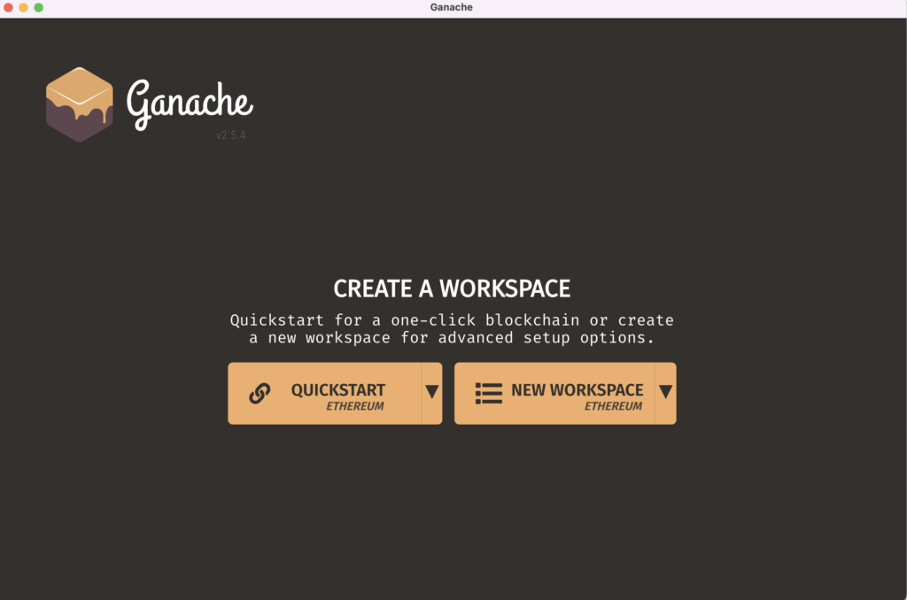
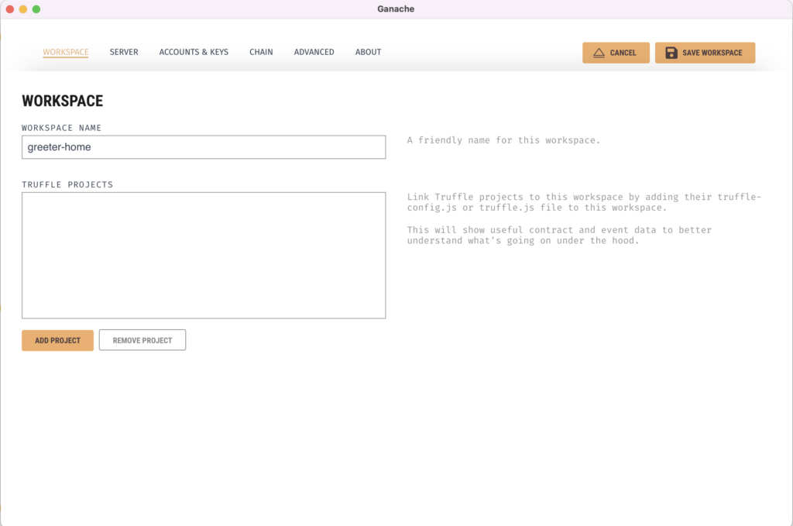
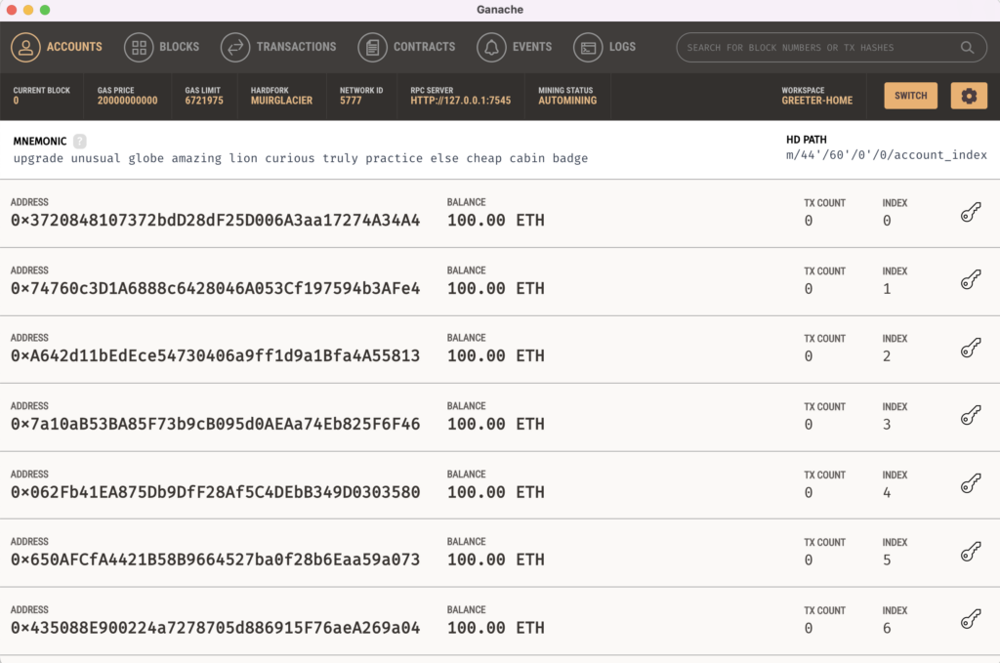
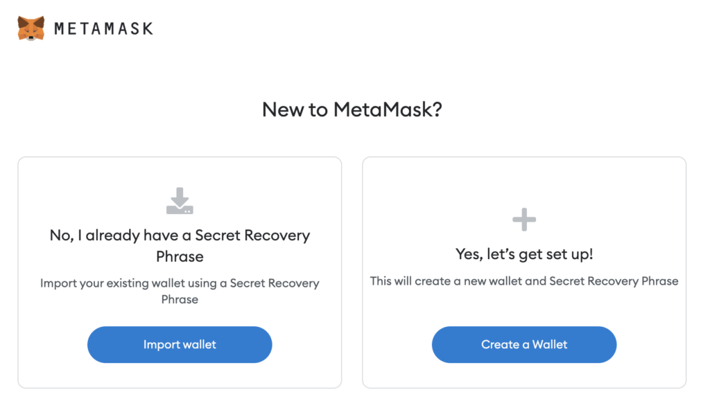
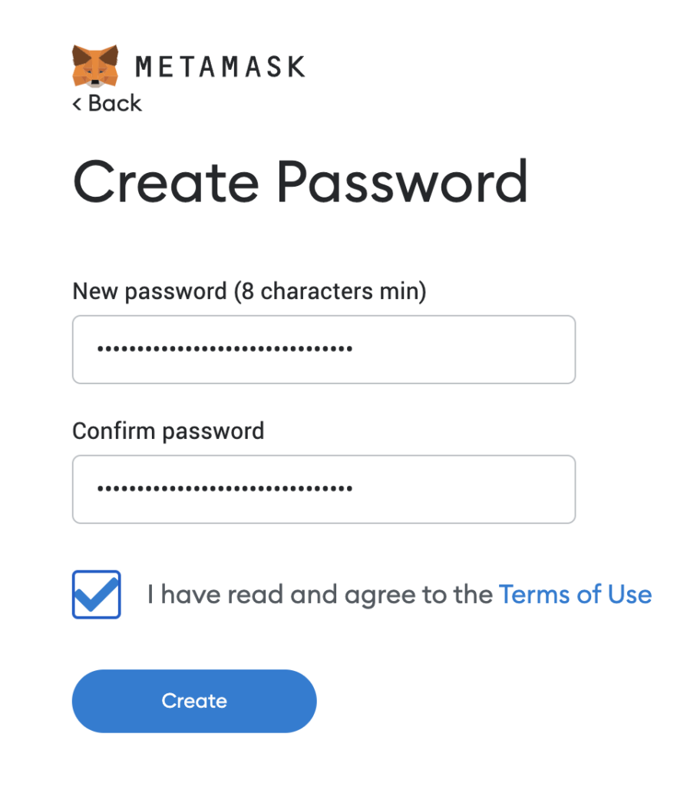
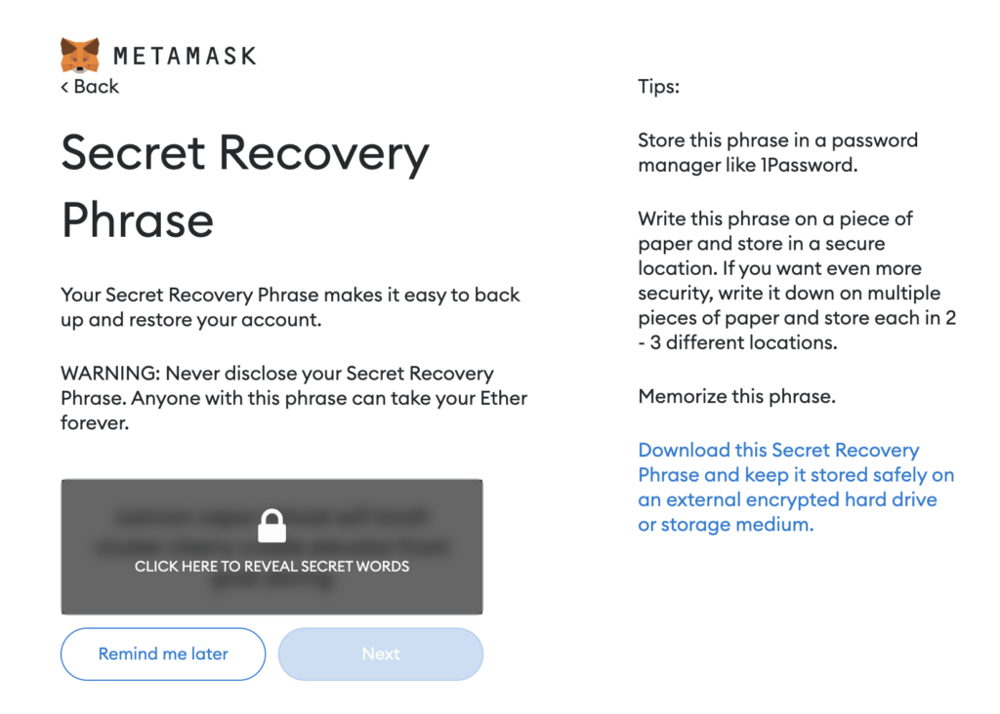
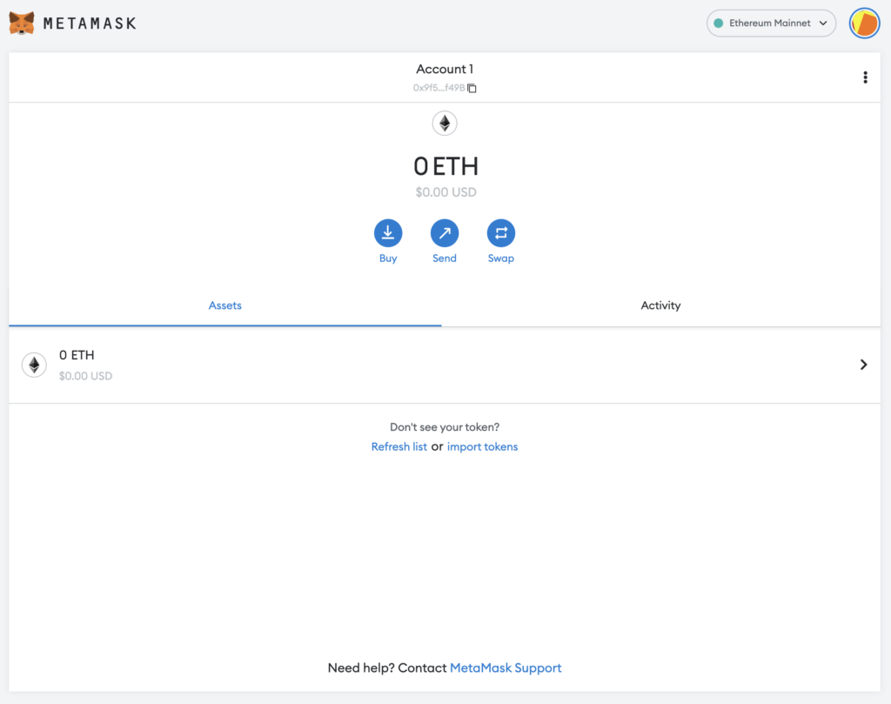
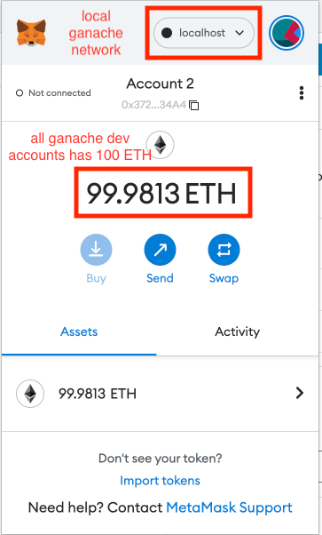

# 4 steps to deploy a Hello World smart contract on your local dev network (thuffle, ganache and metamask)

If you’re at the same point as me, transitioning from Web2 to Web3. The first thing you want to have as your toolset is a local environment where to deploy smart contracts.

Note: This article describe how to create a “Hello World” contract (created with truffle) in a dev local network (using ganache). In my next article I use Angular to use the Smart Contract from a web application.

Deploying smart contract cost gas (eth == money), having a local blockchain for development is the right way to go.

The plan:

1. code a “Hello World” smart contract using truffle
2. create a local blockchain for development using ganache
3. create a wallet in metamask
4. deploy our smart contract into the local blockchain

## 1. Code a “Hello World” smart contract using truffle

### 1.1 install truffle

these are the commands to install truffle globally using npm and yarn.

npm:

```
npn install -g truffle
```

yarn

```
yarn global add truffle
```

## 1.2 create a smart contract with truffle

### create a folder for the smart contract

### run truffle initialisation command

```
mkdir greeter
cd greeter
truffle init
```

## 1.3 add smart contract code

filename: contracts/Greeter.sol

```
// SPDX-License-Identifier: MIT
pragma solidity ^0.8.0;
contract Greeter{
  string _greeting = "Hello, World!";
  address _owner;
  constructor() {
    _owner = msg.sender;
  }
  modifier onlyOwner() {
    require(msg.sender == _owner, "Ownable: caller is not the onwer");
    _;
  }

  function owner() public view returns(address) {
    return _owner;
  }
  function greet() external view returns(string memory) {
    return _greeting;
  }
  function setGreeting(string calldata gretting) external onlyOwner {
    _greeting = gretting;
  }
}

```

filename: test/greeter_test.js

```
const GreeterContract = artifacts.require("Greeter");
contract("Greeter", (accounts) => {
  it("has been deployed successfully", async () => {
    const greeter = await GreeterContract.deployed();
    assert(greeter, "contract was deployed");
  });
  describe("greet()", () => {
    it("returns 'Hello, World!'", async () => {
      const greeter = await GreeterContract.deployed();
      const expected = "Hello, World!";
      const actual = await greeter.greet();
      assert.equal(actual, expected, "greeted with 'Hello, World!'");
    });
  });
  describe("owner()", () => {
    it("returns the address of the owner", async () => {
      const greeter = await GreeterContract.deployed();
      const owner = await greeter.owner();
      assert(owner, "the current owner");
    });
    it("matches the address that originally deployed the contract", async () => {
      const greeter = await GreeterContract.deployed();
      const owner = await greeter.owner();
      const expected = accounts[0];
      assert.equal(owner, expected, "matches address used to deploy contract");
    });
  });
});
contract("Greeter: update greeting", (accounts) => {
  describe("setGretting(string)", () => {
    describe("when message is sent by the owner", () => {
      it("sets greeting to passed in string", async () => {
        const greeter = await GreeterContract.deployed();
        const expected = "The owner changed the message";
        await greeter.setGreeting(expected);
        const actual = await greeter.greet();
        assert.equal(actual, expected, "greeting updated");
      });
    });
    describe("when message is sent by another account", () => {
      it("does not set the gretting", async () => {
        const greeter = await GreeterContract.deployed();
        try {
          await greeter.setGreeting("Not the owner", { from: accounts[1] });
        } catch (err) {
          const errorMessage = "Ownable: caller is not the owner";
          assert.equal(err.reason, errorMessage, "greeting should not update");
          return;
        }
        assert(false, "greeting should not update");
      });
    });
  });
});
```

## 1.4 check the smart contract tests pass

Located in greeter smart contract folder, run:

```
truffle test
```

## 2. Create a local blockchain for development using ganache

### 2.1 Installing desktop ganache

OSX

```
brew install --cask ganach
```

## 2.2 open the application



## 2.3 Create a new workspace

name: greeter-home

truffle projects:

add the path to the folder where you have greeter smart contract



save workspace



## 3. Create a wallet in metamask

Im using metamask as an extension in my browser

### 3.1 Create a wallet



### 3.2 set the password



### 3.3 story the recovery phrase



final view of the new wallet



### 3.4 import an account into metamask


### 3.5 remove old localhost network and add ganache dev network

_Important_: In Metamask, we need to remove the old localhost:8575 network (this is because the new network has the same chainId) and add the new one. The details are in the top of the Ganache app.

### 3.6 Using the key for one account, import into metamask.



Why my account has 99.9813 ETH and not 100 ETH? well, this is the best way to answer why is important to use a dev network for learning, development, testing. Deploying contracts use eth = using eth = using money.

For this example we deployed two contracts:

1. total cost: 0.00497708 ET (1_initial_migration.js by default on any truffle project, you can delete it)
2. total cost: 0.01228406 ET (2_deploy_greeter.js our Hello World contract)

## 4. deploy our smart contract into the local blockchain

### 4.1 update truffle-config.js with ganache setting for development

In the truffle-config.js we have a section where we setup the development section, by default the port number in this file is 8575, but if we check in Ganache application, logs section, it shows 7545:

```
{"gasLimit":6721975,"gasPrice":20000000000,"hardfork":"muirGlacier","hostname":"127.0.0.1","port":7545,"network_id":5777,"default_balance_ether":100,"total_accounts":10,"unlocked_accounts":[],"locked":false,"vmErrorsOnRPCResponse":true,"verbose":false,"db_path":"/Users/agustinvinao/Library/Application Support/Ganache/workspaces/spectacular-carpenter/chaindata"}
```

filename: greeter/truffle-config.js

```
development: {
      host: "127.0.0.1", // Localhost (default: none)
      port: 7545, // Standard Ethereum port (default: none)
      network_id: "*", // Any network (default: none)
},
```

### 4.2 deploying our contract

```
truffle migrate --network development
```

confirm our contract is deployed


